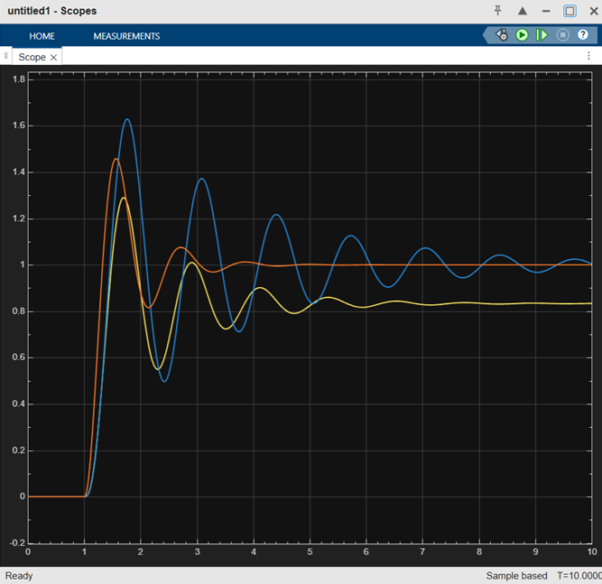

# PID Controller Design & Simulink Verification

This repository demonstrates the design, simulation, and analysis of **Proportional (P)**, **Proportional-Integral (PI)**, and **Proportional-Integral-Derivative (PID)** controllers for a third-order continuous-time system. 

The project combines an automated MATLAB script for calculating parameters via the classic **Ziegler-Nichols (Z-N) closed-loop tuning method** with a **Simulink model** to verify the transient and steady-state performance.

---

## 📌 System Description

The plant model used in this project is a third-order transfer function defined as:

$$G(s) = \frac{5}{(s+2)(s+4)(s+6)} = \frac{5}{s^3 + 12s^2 + 44s + 48}$$

The MATLAB script dynamically determines the system's stability margins to extract the **Ultimate Gain ($K_u$)** and **Ultimate Period ($P_u$)** required for the tuning formulas.

---

## 🛠️ Ziegler-Nichols Tuning Parameters

The controller gains are calculated using traditional Z-N closed-loop tuning rules:

| Controller Type | $K_p$ | $T_i$ | $T_d$ |
| :--- | :--- | :--- | :--- |
| **Proportional (P)** | $0.5 \cdot K_u$ | $-$ | $-$ |
| **Proportional-Integral (PI)** | $0.45 \cdot K_u$ | $P_u / 1.2$ | $-$ |
| **Proportional-Derivative-Integral (PID)** | $0.6 \cdot K_u$ | $P_u / 2$ | $P_u / 8$ |

---

## 🚀 How to Run the Project

### Prerequisites
* MATLAB & Simulink 
* Control System Toolbox

### Execution Steps
1. Clone this repository and ensure all files are in the same working directory.
2. Run the MATLAB script by typing `PIDcontroller` in the Command Window, or press **Run (F5)**. This calculates the controller variables ($K_p, K_i, K_d$) and loads them into your workspace.
3. Open the Simulink model file: `simulinkmodel.slx`.
4. Run the Simulink simulation to feed the workspace parameters into the parallel PID blocks.
5. Double-click the **Scope** block in Simulink to view the live behavioral graph.

---

## 📊 Performance & Outputs

### 1. Command Window Metrics
The script outputs the critical frequency-domain metrics derived from the plant's uncompensated open-loop response:
* **Ultimate Gain ($K_u$):** The gain margin threshold where the system becomes marginally stable.
* **Oscillation Frequency ($\omega_u$):** The phase crossover frequency in rad/s.

### 2. Scope Step Response Comparison
The step response behavior of each controller configuration is visualized through the Simulink Scope block:

* **Proportional Only (P):** Fast response but suffers from a significant steady-state offset.
* **Proportional-Integral (PI):** Eliminates the steady-state error entirely, but introduces heavy oscillations and high overshoot.
* **Proportional-Integral-Derivative (PID):** Provides the optimal balance—eliminating steady-state error, dampening the system to reduce overshoot, and drastically improving settling time.

---

## 📁 Repository Structure

* **`PIDcontroller.m`** - Main MATLAB script containing the plant definition, Z-N tuning mathematical formulas, closed-loop feedback loops, and plotting routines.
* **`simulinkmodel.slx`** - Simulink block diagram layout containing the step input, parallel PID controller configurations, plant transfer function, and routing to the multi-input Scope.
* **`Scope.png`** - Exported screenshot from the Simulink Scope block illustrating the performance comparison of the P, PI, and PID controllers.
* **`README.md`** - Documentation of the project.

---

## 📝 License

This project is open-source and available under the [MIT License](LICENSE).
